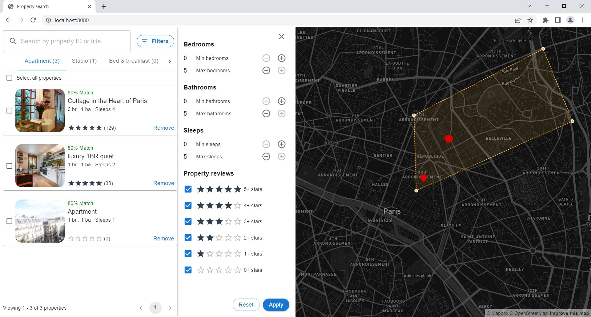

# property-search

A sample react based application for displaying the list of all commercial properties in Paris area

## Steps to execute

- npm install
- npm run start
- Frontend application should be running on port 8080 (http://localhost:8080)

Note: As backend API is returning a CORS error when accessing from localhost, open the chrome browser in CORS disable mode (chrome.exe --disable-web-security --user-data-dir="C:\tmpChromeSession")

## Testing

- Using the backend API all properties around Paris are fetched
- Details of the properties are shown on the left hand side via cards and via markers on the map
- User can search based on property name, the cards & map will refresh accordingly
- User can filter the cards based on few criteria, the cards & map will refresh accordingly
- User can select an area on the map and the cards will be refreshed accordingly
- When user selects a card, the corresponding property on the map will be highlighted and also a small popover will be shown with basic details
- When user selects a property marker on the map, the card list will be scrolled to the corresponding position

## Implementation decisions

- Used Material UI library for consuming components like AutoComplete, Date
- Used CSS-in-JS and also some inline styles as and where needed
- Used "useContext" for storing refs

## Possible improvements over the current implementation

- There is a scope for improvement w.r.t to performance during search & filtering - Couldn't spend time on that
- Could have implemented the mobile view of this app via responsive web designing
- Could have written unit test scenarios & end-to-end testing scenario
- Used ts-ignore at few places as deriving the type over there was bit challenging

## Sample screenshot of application

